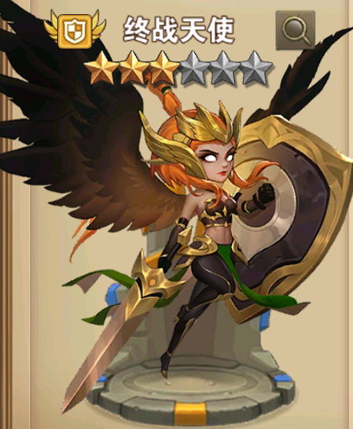
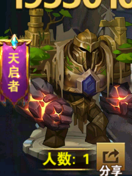
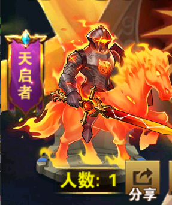
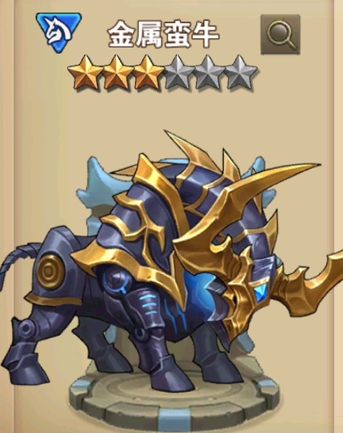
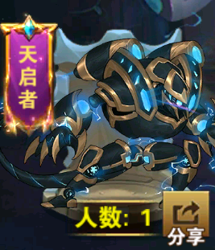
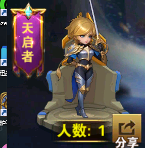

# 天启军团

## 1 终战天使 秩序天1

### 军团定位
肉盾 <防御>

## 2 原处泰坦 秩序天2

### 军团定位
输出 <射手>

## 3 烈焰十字军 秩序天3

### 军团定位
输出 <攻击> 

## 4 金属蛮牛 秩序天4

### 军团定位
辅助 <突击>

## 5 曙光歌者 秩序天5

 

### 军团定位
辅助 <魔法>

## 6 命运之子 秩序天6

### 军团定位
输出 <射手> 

## 7 皇家剑客 秩序天7

### 军团定位
输出 <射手>

## 8 奥数门徒 秩序天8

### 军团定位
输出 <射手>
